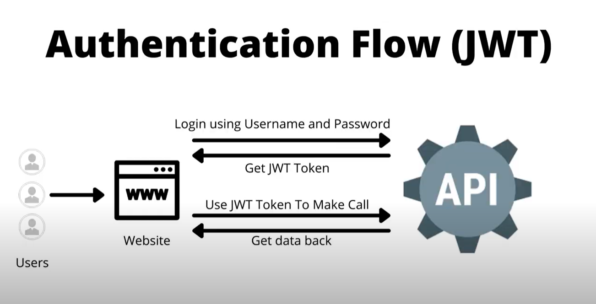
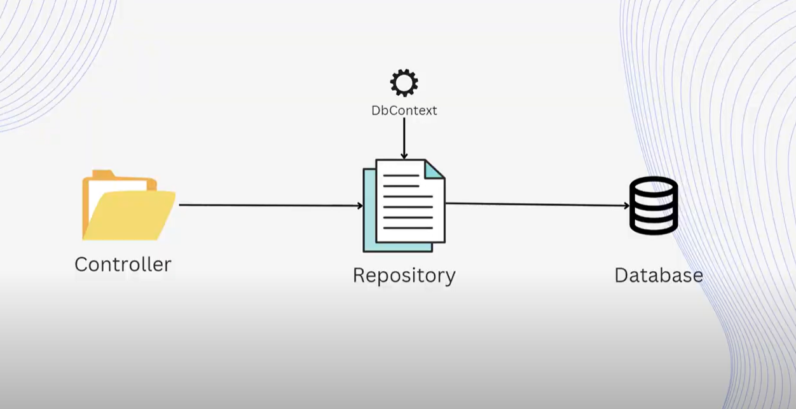


### REST
Representational State Transfter
- Style of architecture for building web services
- Set of principles

### Stateless
- Style of architecture for building web services
- Set of principles

### .NET Core
- HTTP Verbs
- Routing
- Model Binding
- Content Negotiation
- Response Type

### HTTP Verbs
HTTP verbs define the types of actions that can be performed on resource indentified by a URI
- GET
- POST
- PUT
- DELETE
- PATCH
- OPTIONS

### HTTP Verbs
- GET: https://yourapi.com/api/employees (Get All Employees)
- GET: https://yourapi.com/api/employees/{id} (Get Single Employess By Id)
- POST: https://yourapi.com/api/employees/ (Create an Employee)
- PUT: https://yourapi.com/api/employees/{id} (Update an Employee by Id)
- DELETE: https://yourapi.com/api/employees/{id} (Delete an Employess by Id)

### DbContext Class
- Maintaining Connection To Db
- Track Changes
- Perform CRUD Operations
- Bridge between domain models and the database

Controller <--->  DbContext <---> Database

### Dependency Injection
- Design pattern to increase maintainability, testability
- DI build into ASP.net Core
- DI Container is responsible for creating and manageing instances

### Runing EF Core Migration
- Add-Migration "Name of Migration"
- Update-Database

## Authentication & Authorization (JWT Tokens)

### Authentication
- The process to determine a user's indentity
- Username and Password
- By useing authentication, we check if we trust the user

### Authorization
- User permission
- Roles, Policies, Claims
- Check If User has ReadOnly or ReadWrite Role

### Authentication Flow (JWT)

### What is JSON Web Token?
JSON Web Token (JWT) is an open standard (RFC 7519) that defines a compact and self-contained way for securely transmitting information between parties as a JSON object. This information can be verified and trusted because it is digitally signed. JWTs can be signed using a secret (with the HMAC algorithm) or a public/private key pair using RSA or ECDSA.

### Install Nuget Packages
- Microsoft.AspNetCore.Authentication.JwtBearer
- Microsoft.IdentityModel.Tokens
- System.IdentityModel.Tokens.Jwt
- Microsoft.AspNetCore.Identity.EntityFrameworkCore
- Npgsql.EntityFrameworkCore.PostgreSQL
- Microsoft.EntityFrameworkCore.Tools

### Reigster and Login
#### Setting Up Auth Database
- Create New Connection String
- Create New DbContext with Roles (Seed Data)
- Inject DbContext and Identity(ASP.NET Core Identity)
- Run EF Core Migration

#### Rolse
- Reader (GET)
- Writer (POST, PUT, DELETE)

### Run EF Core Migration To Create Identity Database
- Add-Migration "Creating Auth Database"
- Update-Database

### Create Controller and Actions
> GET/POST/PUT/DELETE

### DTOs
Data Transfer Objects
- Used to transfer data between different layers
- Typically contain a subset of the properties in the domain model
- For example transferring data over a network

### Advantages Of DTOs
- Separation of Concerns
- Performance
- Security
- Versioning

### Asynchronous Programming, Repository Pattern, Automapper
#### Asynchronous Programming
- Traditional Synchronous programming - program execution is blocked
- Poor performance (Synchronous programming)
- Async/await keywords
- More requests

### Repostiry Parttern
- Design pattern to separate the data access layer from the application
- Provides interface without exposing implementation
- Helps create abtraction

Ctroller > Repository > Database

#### Benefits of Repostiry Parttern
- Decoupling
- Consistency
- Performance
- Multiple data sources (switching)

### Automapper

- Object-to-object mapping
- Simplification
- Map between DTOs and Domain Models and Vice-versa
- Quite powerfull apart from just simple object-to-object mapping

> Install Package for Automapper is AutoMapper

### Navigation Properties
- Allow to Navigatte from on Entity To Another
- Walks Domain model will have region Navigation Property

### Current todo
https://drive.google.com/drive/folders/1Khn3PLuCGkkm7WDBaZZ5WkV1e1L39EK_
https://www.udemy.com/course/build-rest-apis-with-aspnet-core-web-api-entity-framework/